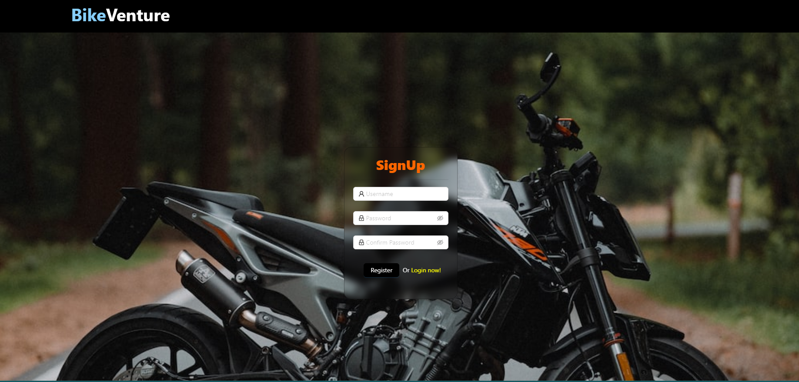
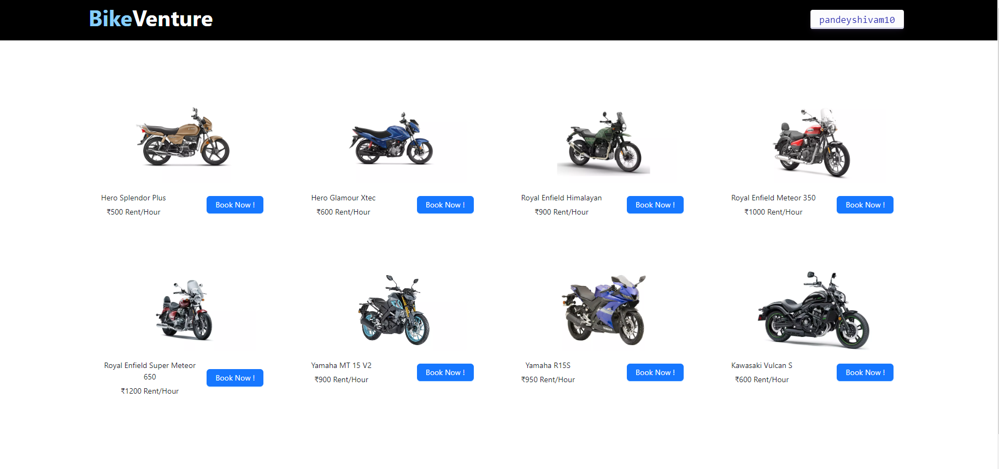
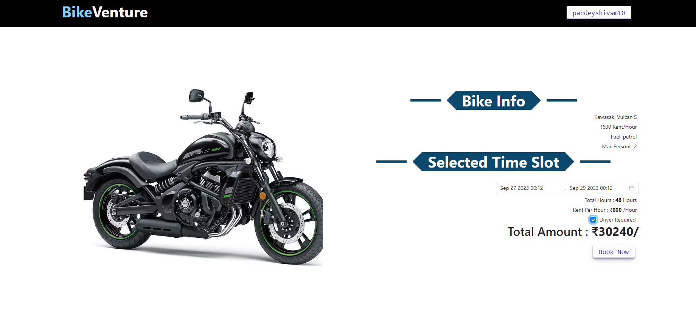

# BikeVenture
https://bike-venture.vercel.app/login

# BikeVenture 

This is a bike rental system project built using React, Redux, Ant Design (antd), Node.js, Express.js, and MongoDB.

## Overview

The bike rental system allows users to rent bikes online. Users can browse available bikes, view bike details, make reservations, and manage their rental history.

## Features

- User Registration and Authentication
- Bike Listing and Details
- Reservation System

## Technologies Used

- **Frontend**: React, Redux, Ant Design (antd), CSS
- **Backend**: Node.js, Express.js
- **Database**: MongoDB

